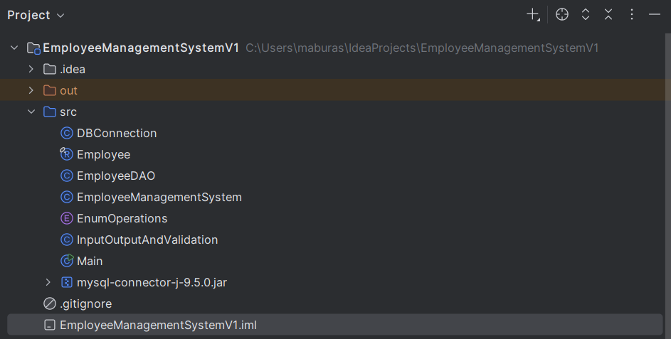

# Employee Management System 
A complete console-based Employee Management System built using **Core Java 17** and **MySQL (JDBC)** — without any frameworks.  
Implements full CRUD operations, input validation, DAO pattern, and a clean interactive menu.

---

## 📌 Features
- Add new employee  
- View all employees (formatted table)  
- Search employee by ID  
- Update employee information  
- Delete employee by ID  
- Console-based menu that loops until Exit  
- Safe input handling and validation  
- Uses Java 17 `record` for the Employee model  
- All database operations use **PreparedStatement + JDBC**  
- Implements DAO & Singleton design patterns  

---

## 🛠️ Tech Stack
- **Java 17**
- **MySQL Server 9.5.0**  
  Download: https://cdn.mysql.com//Downloads/MySQL-9.5/mysql-9.5.0-winx64.msi
- **MySQL JDBC Driver (mysql-connector-j 9.5.0)**  
  Download: https://cdn.mysql.com//Downloads/Connector-J/mysql-connector-j-9.5.0.zip
- No frameworks (No Spring, No Hibernate, No Jakarta)

---

## 📂 Project Structure



---

## MySQL Database Setup

Run the following SQL script to create the database and table:


```sql
CREATE DATABASE company_db;
USE company_db;

CREATE TABLE employees (
    id INT PRIMARY KEY AUTO_INCREMENT,
    name VARCHAR(100) NOT NULL,
    email VARCHAR(100) UNIQUE NOT NULL,
    department VARCHAR(50),
    salary DOUBLE NOT NULL,
    joining_date DATE DEFAULT (CURRENT_DATE)
);

```
**Table**


## 🔌 Configure MySQL Connection

Update your MySQL username/password in:
DBConnection.java

```java
private static final String user = "root";
private static final String password = "123456";
private static final String url = "jdbc:mysql://localhost:3306/company_db";
```
## Adding MySQL JDBC Driver (mysql-connector-j)

1) Download MySQL Connector JAR from: https://dev.mysql.com/downloads/connector/j/
2) Place the jar file inside your project folder:
3) EmployeeManagementSystemV1/src/mysql-connector-j-9.5.0.jar

Add the JAR to classpath through IntelliJ IDEA:
File → Project Structure → Modules → Dependencies → + → JAR

For **Windows** Use the following screenshots as a guide to properly add the MySQL JDBC driver to your project:
1) Go to - **MySQL JDBC Driver (mysql-connector-j 9.5.0)**  and Copy the file :
   


2) Then go to **intellij** and paste it:


3) go to **Project Structure**:


   


